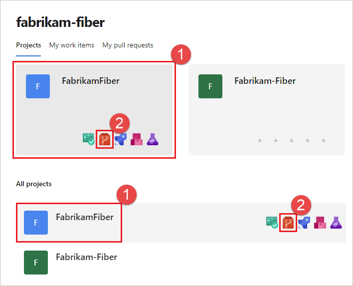
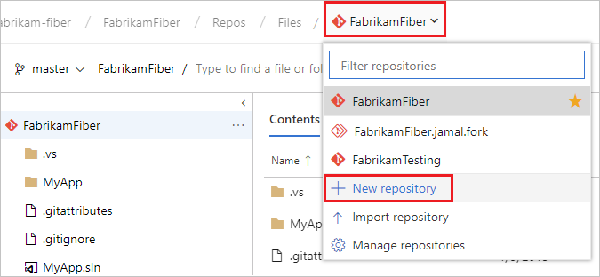

# Azure Repos

Azure Repos هو مجموعة من أدوات التحكم في الإصدارات التي يمكنك استخدامها لإدارة شيفرتك. سواء كان مشروع البرمجيات الخاص بك كبيرًا أم صغيرًا، فإن استخدام نظام التحكم في الإصدارات في أقرب وقت ممكن هو فكرة جيدة.

## مقدمة

نظم التحكم في الإصدارات هي برمجيات تساعدك على تتبع التغييرات التي تقوم بها في شيفرتك على مر الوقت. عند تحرير شيفرتك، تُخبر نظام التحكم في الإصدارات بأن يأخذ لقطة (snapshot) من ملفاتك. يحفظ نظام التحكم في الإصدارات تلك اللقطة بشكل دائم حتى يمكنك استرجاعها لاحقًا إذا احتجت إليها. استخدم نظام التحكم في الإصدارات لحفظ عملك وتنسيق تغييرات الشيفرة عبر فريقك.

## الفوائد

حتى إذا كنت مطورًا فرديًا فقط، يساعدك نظام التحكم في الإصدارات في البقاء منظمًا أثناء إصلاح الأخطاء وتطوير الميزات الجديدة. يحتفظ نظام التحكم في الإصدارات بتاريخ تطويرك بحيث يمكنك مراجعته وحتى العودة إلى أي إصدار من شيفرتك بسهولة.

## البداية

### البدء في مشروع جديد

**1. إنشاء مستودع في Azure DevOps:**
   - انتقل إلى صفحة Repos في مشروعك على Azure DevOps.
   - حدد اسم مشروعك، ثم اختر أيقونة Repos. يمكنك اختيارها من قائمة "All projects" أو "Recent projects" إذا كنت قد وصلت إليها مؤخرًا.
   
   - من قائمة خيارات المشروع، اختر "New repository".
   
   - في نافذة إنشاء مستودع جديد، تأكد من أن نوع المستودع هو Git وأدخل اسمًا لمستودعك الجديد.

**2. استنساخ المستودع:**
   - حدد "Clone" في الزاوية العلوية اليمنى لنافذة الملفات وانسخ عنوان الاستنساخ (Clone URL).
   

**3. فتح نافذة أوامر Git:**
   - افتح نافذة أوامر Git (Git Bash على Git for Windows) في مجلد المشروع.
   
   - قم بتشغيل الأمر `git clone` متبوعًا بالمسار الذي تم نسخه من عنوان الاستنساخ (Clone URL) في القسم السابق.
   ```bash
   git clone الصق url من Azure Repo
   ```
   مثال:
   ```bash
   git clone https://github.com/your/repository.git
   ```
   - انتقل إلى المجلد الخاص بمشروعك:
   ```bash
   cd اسم-المشروع
   ```
   مثال:
   ```bash
   cd repository
   ```

### إجراء تغييرات وتأكيدها:

1. قم بتحرير الملفات على جهاز الكمبيوتر الخاص بك.
2. بعد الانتهاء من العمل، قم بتأكيد التغييرات محليًا باستخدام الأوامر التالية في نافذة أوامر Git:
   ```bash
   git add .
   git commit -m "وصف التغييرات هنا"
   ```
3. قم برفع التأكيد إلى المستودع على الخادم باستخدام الأمر:
   ```bash
   git push origin main
   ```

   تأكد من استبدال "وصف التغييرات هنا" بوصف دقيق للتغييرات التي قمت بها.

**4. التبديل إلى البوابة الإلكترونية وعرض سجل التاريخ:**
   - انتقل إلى صفحة المستودع على الخادم لعرض التغييرات.
   

## إضافة Git إلى مشروع موجود

لإضافة Git إلى مشروع موجود مسبقًا، اتبع هذه الخطوات:

**1. تحديث ملف `.gitignore`:**
   - إذا لم

 يكن ملف `.gitignore` موجودًا في مشروعك، أنشئ واحدًا.
   - قم بتحديث الملف لتجنب تتبع الملفات والمجلدات غير المرغوب فيها أو المؤقتة.
   - قم بإضافة الصيغ التي ترغب في تجنب تتبعها (رفعها)، مثل ملفات التفاصيل الفردية أو المجلدات.

**2. تهيئة Git:**
   - افتح نافذة أوامر Git وانتقل إلى مجلد مشروعك.
   - قم بتشغيل الأمر `git init` لبدء Git في المجلد الحالي.
     ```bash
     git init
     ```

**3. إضافة الملفات وتأكيدها:**
   - استخدم الأوامر التالية لإضافة جميع الملفات وتأكيدها.
     ```bash
     git add .
     git commit -m "وصف التغييرات هنا"
     ```

**4. ربط مشروعك بمستودع على خادم Git:**
   - قم بإنشاء مستودع Git على خادم Azure DevOps (بنفس الطريقة السابقة).
   - استنسخ عنوان الاستنساخ (Clone URL) من المستودع.

**5. ربط مشروعك المحلي بالمستودع البعيد:**
   - قم بتشغيل الأمر `git remote add origin <عنوان الاستنساخ>`.
     ```bash
     git remote add origin <عنوان الاستنساخ>
     ```
     مثال:
     ```bash
     git remote add origin https://github.com/your/repository.git
     ```
   - ثم قم بتشغيل الأمر `git push -u origin main` لرفع التأكيدات إلى المستودع البعيد.
     ```bash
     git push -u origin main
     ```

## العمل مع تغييرات الآخرين والعمل على جهاز مختلف

عندما يقوم أحد أعضاء الفريق بتحديث المستودع البعيد، يجب عليك جلب (Pull) تلك التغييرات إلى مشروعك المحلي باستخدام الخطوات التالية:

**1. تحديث مشروعك:**
   - قبل سحب التغييرات، تأكد من أن مشروعك المحلي ليس به تعديلات غير مؤكدة. قم بتأكيد.
     ```bash
     git status  # للتحقق من حالة مشروعك
     git commit -m "وصف التغييرات"  # لتأكيد التغييرات المحلية إذا لزم الأمر
     ```

**2. سحب التغييرات:**
   - قم بتشغيل الأمر git pull لجلب آخر التغييرات من المستودع البعيد.
     ```bash
     git pull origin main  # افترض أن الفرع الرئيسي هو "main"
     ```

3. حل الصدامات (إذا لزم الأمر):

في حالة وجود صدامات (conflicts)، يجب عليك حلها يدويًا.

صدامات الدمج (conflicts) تحدث عندما يحدث تعديل في نفس السطر أو الملف أثناء الفترة التي قام فيها أحد الفرق بالعمل على النسخة المحلية للمستودع (repository) والتي قام الآخر بالعمل على النسخة البعيدة (remote repository).


للتوضيح ، إليك سيناريو يمكن أن يؤدي إلى حدوث صدامات:

المستخدم A يستند إلى إصدار معين من المستودع ويقوم بإجراء تغييرات على ملفات معينة.

المستخدم B يستند أيضًا إلى نفس الإصدار ويقوم بإجراء تغييرات مختلفة على نفس الملفات التي قام المستخدم A بتغييرها.

المستخدم A يقوم برفع (push) تغييراته إلى المستودع البعيد.

المستخدم B يحاول أيضًا رفع تغييراته إلى المستودع البعيد، ولكن يحدث صدام (conflict) لأن هناك تغييرات تم إجراؤها في نفس السطر أو الملف. 
